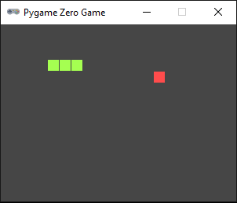

# 🐍 Snake Game using Pygame Zero

This is a classic Snake game implemented in **Python** using the **Pygame Zero** library. It's a simple yet engaging game where the player controls a growing snake that must eat food to grow longer — but avoid crashing into itself!

## 🎮 Game Rules

- Use **arrow keys** to control the snake's direction.
- The snake **wraps around** the screen edges.
- Eating food makes the snake grow.
- If the snake **collides with itself**, the game resets after a short pause.
- Snake color changes to gray on collision to indicate game over.

## 🖥️ Screenshot

> *(Optional: Add a screenshot here)*  
> 

## 📦 Features

- Grid-based movement
- Dynamic food generation (avoids spawning on the snake)
- Snake growth upon eating
- Self-collision detection
- Edge wrap-around logic
- Simple reset mechanism on game over

## 🛠️ Technologies Used

- **Python 3**
- **Pygame Zero 1.2**

## ▶️ How to Run

### 1. Install Pygame Zero:

```bash
pip install pgzero
